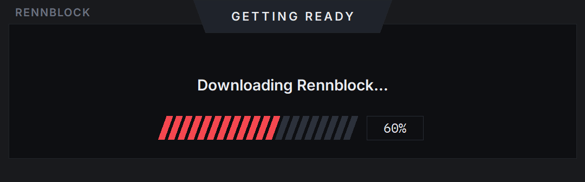
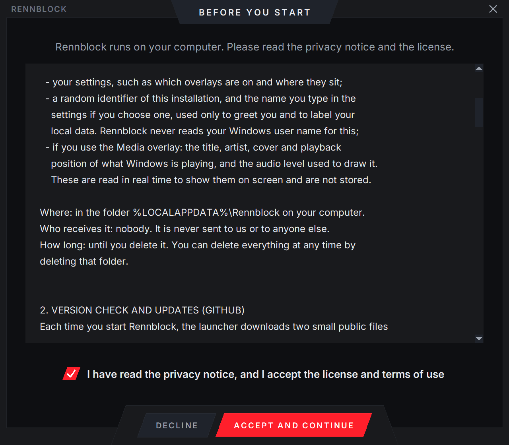
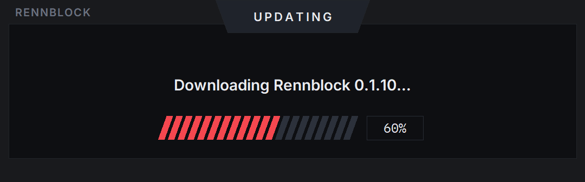

# Installing Rennblock

Rennblock runs on Windows 10 or 11, 64-bit, next to Assetto Corsa EVO. You need one file: it sets Rennblock up and keeps it up to date, and it stays the same file from one version to the next.

## 1. Download

**[Download `Rennblock.exe`](https://github.com/benghe-raul/rennblock-status/releases/latest/download/Rennblock.exe)**

## 2. Run it

Double-click `Rennblock.exe`. If Windows stops it, see **[If Windows blocks Rennblock](#if-windows-blocks-rennblock)** below, then come back here.

## 3. Getting ready

The first time, a small window downloads Rennblock's launcher and checks it. It takes a few seconds.

## 4. Read and accept

The launcher shows the privacy notice and the license. Tick the box and choose **Accept and continue**.

## 5. Let it download

The launcher downloads Rennblock and checks every file against its published fingerprint. It installs in your user folder, so no administrator rights are needed, and it adds Rennblock to the Start menu and to Installed apps.

## 6. Drive

Start Assetto Corsa EVO and go on track. The telemetry overlay is on from your first lap, at the bottom centre of the screen.

The panel opens from the Rennblock icon in the tray, next to the clock. There you can switch each overlay on or off, choose what it shows, place it on the screen and see your laps.

## Updates

When a new version is out, the launcher offers it as Rennblock starts: **Update now**, **Not now** or **Skip this version**.

## Removing it

Open **Settings → Apps → Installed apps**, find Rennblock and choose **Uninstall**, or use the Start menu. It asks whether to keep your laps and settings or delete them.

## Coming from 0.1.10

If your Rennblock says it has a new launcher, download `Rennblock.exe` again from the link above and open it. Your laps, settings and app are all still there, and the Start menu and Installed apps move to the new file by themselves.

## If Windows blocks Rennblock

Rennblock is an independent project and is not code-signed, so Windows does not know its publisher. Depending on how your PC is set up you may see one of these messages.

### "Windows protected your PC"

This is SmartScreen. Choose **More info**, then **Run anyway**.

### "Smart App Control blocked an app that may be unsafe"

Smart App Control lets only apps it already knows, or signed ones, run, and it checks them every time they start, so it has no Run anyway button. Rennblock can run only while it is off:

1. Open **Windows Security → App & browser control → Smart App Control settings**.
2. Choose **Off**.
3. Run `Rennblock.exe` again.

Smart App Control is on only on some PCs with a fresh installation of Windows 11.

### "The app you're trying to install isn't a Microsoft-verified app"

Your PC is set to install apps from the Microsoft Store only. Open **Settings → Apps → Advanced app settings → Choose where to get apps**, pick **Anywhere**, and run `Rennblock.exe` again.

## Something went wrong

Write to benghe.web@gmail.com and attach `%LOCALAPPDATA%\Rennblock\launcher.log`.
