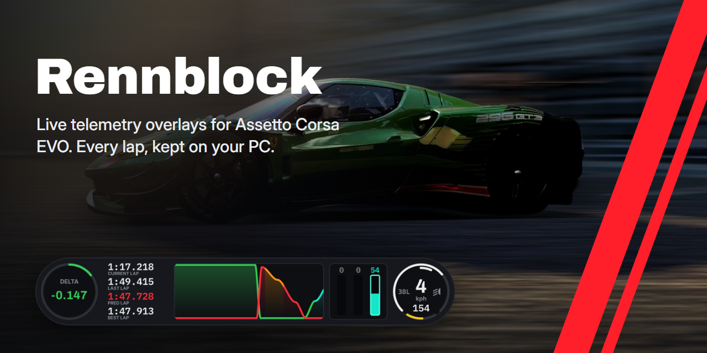
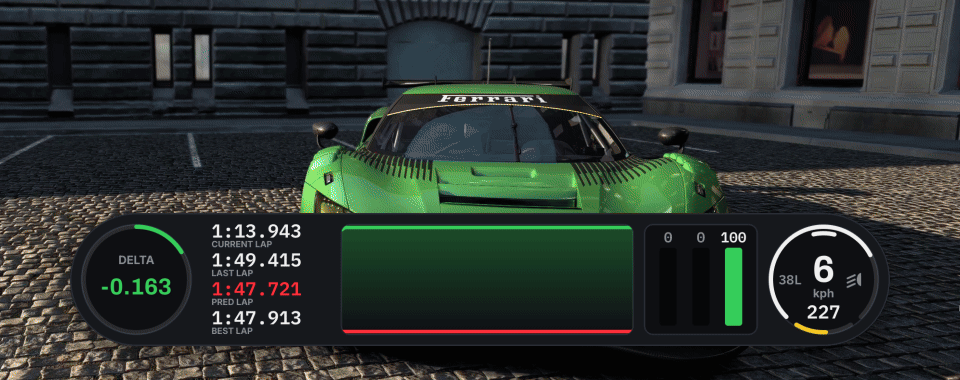
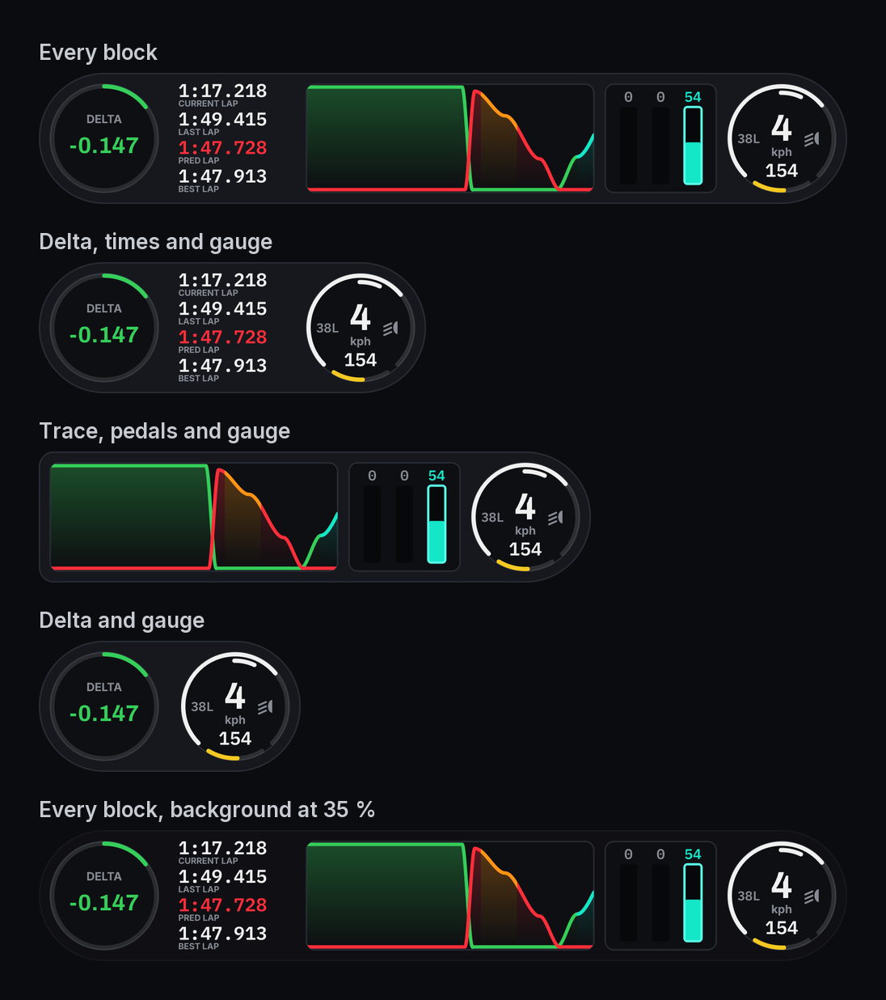
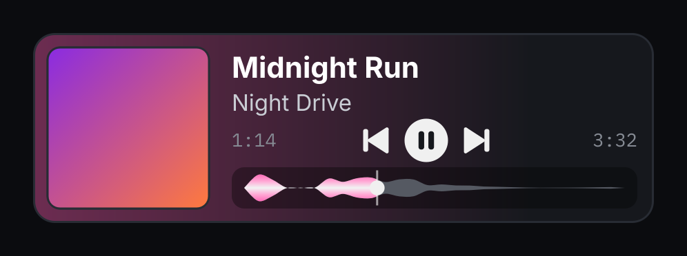
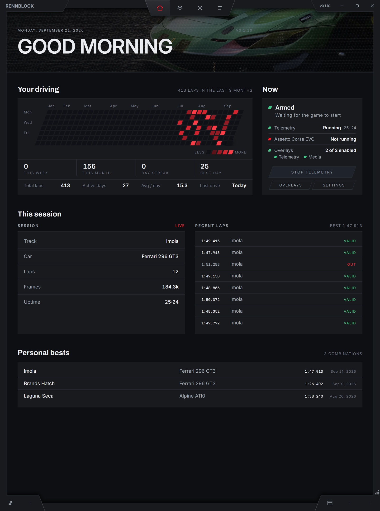
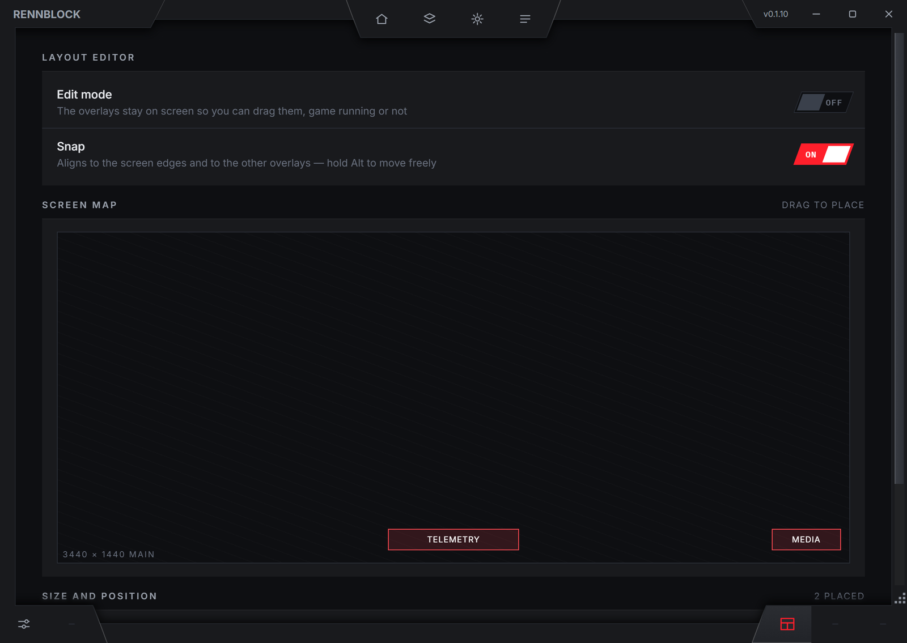
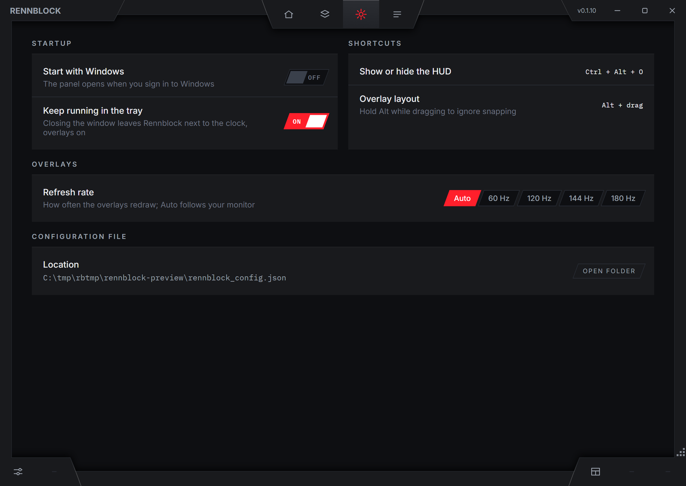
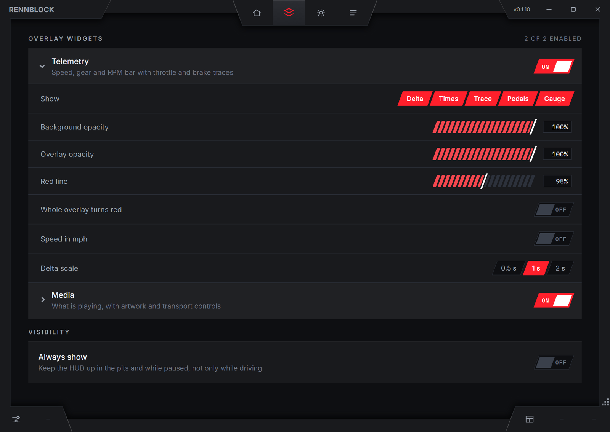
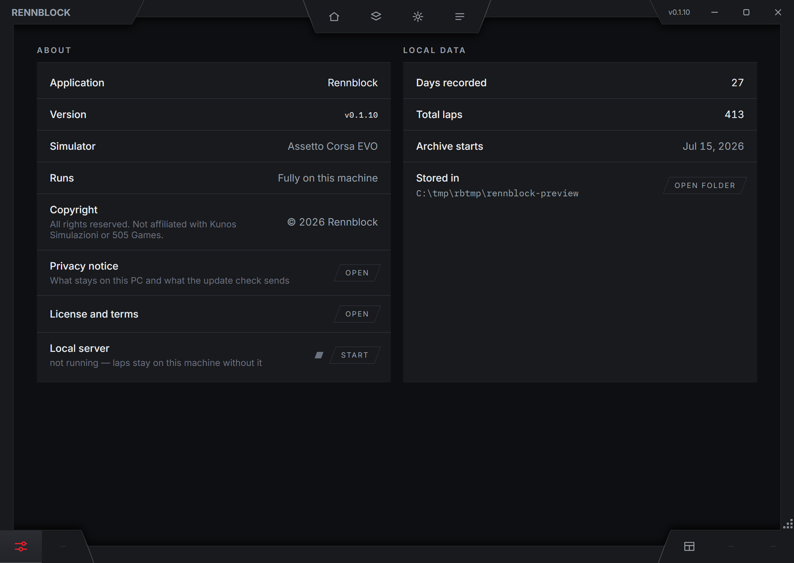
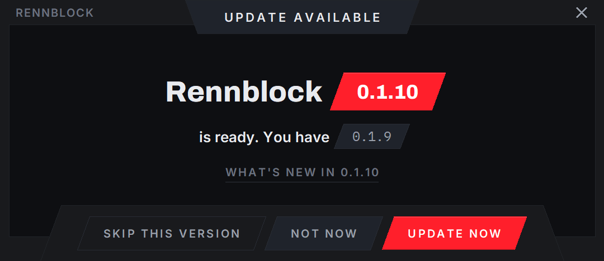

  

  

  <b>Live telemetry overlays for Assetto Corsa EVO.</b> 
  Know whether this lap is faster while you are still driving it, see every brake and throttle input, 
  and keep every lap you have ever driven, on your own PC.

  Windows 10 or 11, 64-bit &nbsp;·&nbsp;
  <a href="https://github.com/benghe-raul/rennblock-status/releases/latest">What's new</a> &nbsp;·&nbsp;
  <a href="INSTALL.md">Install guide</a> &nbsp;·&nbsp;
  <a href="INSTALL.md#if-windows-blocks-rennblock">If Windows blocks it</a>

 

  
   The telemetry overlay as Rennblock draws it, laid over a frame from the game.

## A telemetry overlay that tells you how the lap is going

- **Delta, live against your best lap.** Green while you are ahead, red when you are behind, and the ring fills as the gap grows.
- **Lap times:** current, last, predicted and best.
- **The throttle and brake trace** of the last seconds: how hard you braked, how long you coasted, when you went back to full power.
- **Pedal bars** for clutch, brake and throttle.
- **Gear, speed and fuel**, with the rev arc.
- **TC and ABS** turn the bars and the trace aqua and orange only when they act, so you see exactly where the car needed help.

The game is read 200 times a second, and the overlays are native windows drawn by the app itself, on top of the game.

## Build your own overlay

Show only the blocks you want, in any combination. Set how see-through the background is and how opaque the whole overlay is, where the rev arc turns red (and whether the whole overlay turns red with it), speed in km/h or mph, how much delta fills the ring (0.5, 1 or 2 seconds), and the size of each overlay from 30 % to 200 %.

## Your music, on screen

The media overlay shows what Windows is playing: cover, title, artist and position, with the playback controls and a wave drawn from the sound.

## Every lap, kept

Rennblock saves your laps as you drive.

- **Your driving:** a calendar of the days you were on track, with this week, this month, your streak and your best day.
- **This session:** track, car and laps, live.
- **Recent laps**, each one marked valid or out.
- **Personal bests**, one per track and car, from valid laps only.

## Every overlay where you want it

Drag the overlays on a map of your screen, with or without the game running. They snap to the screen's edges and to each other (hold Alt to place them freely), and each one has its own size.

## Settings that stay out of the way

Start Rennblock with Windows if you like, and leave it in the tray: closing the window keeps the overlays on. **Ctrl + Alt + O** shows or hides them, and the refresh rate follows your monitor or is set to 60, 120, 144 or 180 Hz.

## Everything stays on your PC

There is no account. Your laps and settings are stored in `%LOCALAPPDATA%\Rennblock` and are never uploaded anywhere; delete that folder and they are gone. Rennblock fetches only the list of versions from this page when it starts, and a new version when you choose to update.

## Updates you can trust

You download one file, `Rennblock.exe`, once. It installs Rennblock in your user folder (no administrator rights), adds it to the Start menu, checks every file against its published fingerprint each time it starts, and offers each new version: **Update now**, **Not now** or **Skip this version**.

## Install

1. **[Download `Rennblock.exe`](https://github.com/benghe-raul/rennblock-status/releases/latest/download/Rennblock.exe)** and run it.
2. Windows may stop it, because Rennblock is not code-signed: **[here is what to do](INSTALL.md#if-windows-blocks-rennblock)**.
3. Read the privacy notice and the license, tick the box, and choose **Accept and continue**. The launcher downloads Rennblock and checks it.
4. Start Assetto Corsa EVO and drive. The telemetry overlay is on from your first lap, at the bottom centre of the screen; the panel opens from the tray icon.

The **[install guide](INSTALL.md)** walks through it with pictures.

## Questions

**Why does Windows warn me about it?**
Rennblock is an independent project and is not code-signed, so Windows does not know its publisher and asks you first. The **[install guide](INSTALL.md#if-windows-blocks-rennblock)** shows what each warning means and what to do. What you run is checked by the launcher: every file must match the fingerprint published here, in a list signed with a key built into the launcher.

**Does it send my data anywhere?**
No. Everything stays on your PC. At start the launcher reads two small public files from this page, the version list and its signature, and nothing else leaves your computer.

**Which games does it work with?**
Assetto Corsa EVO.

**How do I remove it?**
From **Settings → Apps → Installed apps**, or from the Start menu. It asks whether to keep your laps and settings or delete them.

## Support

Write to benghe.web@gmail.com. If the launcher failed, attach `%LOCALAPPDATA%\Rennblock\launcher.log`.

## How the updates are checked

This repository is not the source code. It carries the signed update list that the launcher reads:

- `manifest.json` — the current release, where to download it, and the SHA-256 fingerprint of every file that is checked each time Rennblock starts.
- `manifest.sig` — the Ed25519 signature of `manifest.json`.

The launcher accepts an update list only when that signature matches the public key built into it, so a tampered list is refused even if this repository were altered. Each release contains the launcher and the application archive, with their fingerprints written in the release notes.

---

Rennblock is an independent project. It is not affiliated with, endorsed by, or connected to Kunos Simulazioni or 505 Games.
